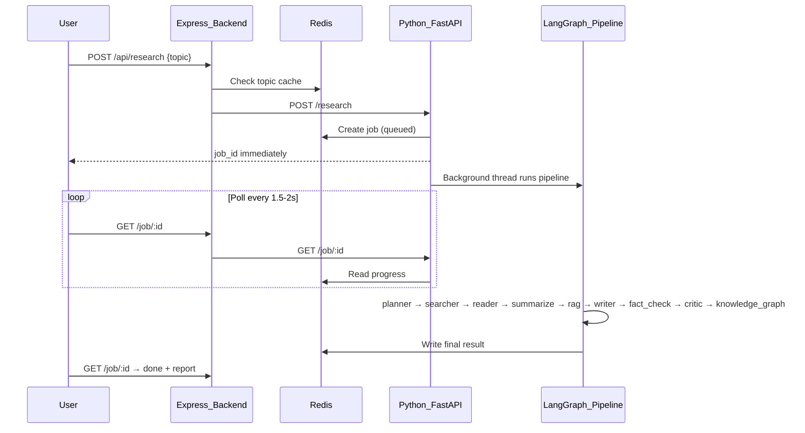
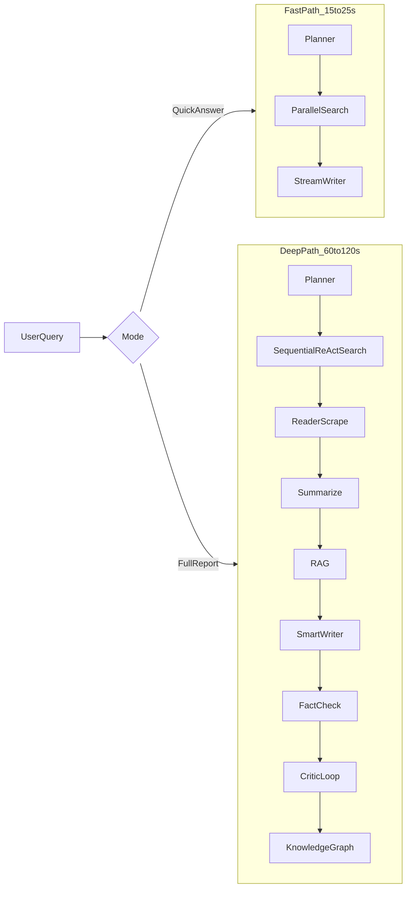

# Agent Performance: Why It's Slow & How to Fix It (Learning Session)

## How Your Agent Works Today

When a user submits a research topic, this is the full journey:



### The 10-stage pipeline (strictly sequential)

Each node in [`MultiAgentPart/pipeline/runner.py`](MultiAgentPart/pipeline/runner.py) waits for the previous one to finish:

| Stage | What it does | LLM? | Typical cost |
|-------|--------------|------|--------------|
| **Planner** | Breaks topic into 4 sub-questions + 4 search queries | fast (`mistral-small`) | ~3–8s |
| **Searcher** | Runs 4 searches **one after another** | fast ReAct agent × 4 | ~40–80s |
| **Reader** | Scrapes top 3 URLs in parallel | none (HTTP scrape) | ~3–8s |
| **Summarize** | Condenses scraped text to bullet facts | fast | ~5–10s |
| **RAG** | Embeds text, stores/retrieves from Qdrant | embeddings only | ~5–15s (cold) |
| **Writer** | Writes full research report | **smart** (`mistral-large`) | ~15–30s |
| **Fact-check** | Verifies claims against sources | fast | ~5–10s |
| **Critic** | Scores report 0–10 | fast | ~3–8s |
| **Knowledge graph** | Extracts nodes/edges from report | **smart** | ~10–20s |
| **Rewrite loop** | If score &lt; 8, repeats writer + fact-check + critic | +3 LLM calls | +30–50s |

**Your own docs already acknowledge this:** [`MultiAgentPart/api/server.py`](MultiAgentPart/api/server.py) line 7 says the pipeline takes **90–120 seconds** — and that is the *designed* baseline, before rewrite loops or slow API responses.

---

## Main Issues (Root Causes of 2–3+ Minute Waits)

### Issue 1: Search is the biggest bottleneck (~40–50% of total time)

In [`MultiAgentPart/agents/searcher_agent.py`](MultiAgentPart/agents/searcher_agent.py), queries run in a **serial loop**:

```python
for i, query in enumerate(queries):
    result = run_search_agent(patched_state, search_agent)
```

Each call goes through a **ReAct agent** ([`search_agent.py`](MultiAgentPart/agents/search_agent.py)) — not a direct Tavily call. That means:

1. LLM reads the query and decides to call a tool
2. Tavily API returns results (~1–3s)
3. LLM reads results and formats a response

**4 queries × (LLM + Tavily + LLM) = 4 full agent cycles**, all sequential.

**ChatGPT/Perplexity difference:** They fire multiple search queries **in parallel** and often skip the ReAct reasoning loop — direct search API → immediate snippets.

---

### Issue 2: Too many LLM passes (quality over speed)

A typical run makes **9–10 LLM calls minimum**. With a critic rewrite (score &lt; 8), it becomes **12–15+**.

You use two model tiers ([`model.py`](MultiAgentPart/pipeline/model.py)):
- `fast` = mistral-small (planner, search, summarize, fact-check, critic)
- `smart` = mistral-large (writer, knowledge graph)

The **writer** and **knowledge graph** on the large model alone can add 25–50 seconds.

**ChatGPT/Perplexity difference:** Usually **1 synthesis LLM call** after search. No separate fact-check, critic, or knowledge-graph extraction in the user-facing path. Quality loops are internal or skipped for speed.

---

### Issue 3: No streaming to the user (perceived slowness)

Your pipeline supports node-level updates via `stream_research()`, but the user sees:
- "queued" → "running" → ... silence for 90+ seconds ... → "done"

You have `run_writer_streaming()` in [`chains.py`](MultiAgentPart/pipeline/chains.py) but it is **not wired into the live pipeline**. The user waits for the *entire* graph to finish before seeing any answer.

**ChatGPT/Perplexity difference:** First tokens appear in **1–3 seconds** via streaming. Even if total work takes 30s, the user reads partial answer immediately — it *feels* instant.

---

### Issue 4: Over-fetching then under-using content

- Searcher collects URLs from 4 queries (up to ~20 URLs)
- Reader only scrapes **3 URLs** ([`reader_agent.py`](MultiAgentPart/agents/reader_agent.py) line 22: `verified_urls[:3]`)
- Writer gets search snippets + scraped content + RAG context + summarized content — **redundant overlapping context** in one huge prompt

You pay the cost of 4 searches but only deeply use 3 pages. The writer prompt is large, which slows the smart model further.

---

### Issue 5: Built-in quality loop can double writer time

[`runner.py`](MultiAgentPart/pipeline/runner.py) routes back to writer if `critique_score < 8` (up to `max_retries: 1`). That adds another writer (smart) + fact-check + critic cycle — easily **+30–50 seconds** with no user-visible progress change.

---

### Issue 6: Caching exists but search cache is unused

- Express backend caches **finished topics** in Redis (24h) — good for repeat queries
- [`cached_search()`](MultiAgentPart/tools/cache_tool.py) is implemented but **never called** in the search flow — every new topic hits Tavily fresh every time

---

### Issue 7: Knowledge graph runs on every successful run

The knowledge graph node uses **mistral-large** and runs even when the user only wants a text answer. It is valuable for visualization but adds 10–20s to every request.

---

## Why ChatGPT / Perplexity Feel "Instant"

| Dimension | Your agent | ChatGPT / Perplexity |
|-----------|------------|----------------------|
| Pipeline depth | 10 sequential stages | 2–3 stages (search → synthesize) |
| LLM calls | 9–15+ | 1–2 |
| Search execution | Sequential ReAct × 4 | Parallel direct search |
| First visible output | After full pipeline (~90s+) | Streaming tokens (~1–3s) |
| Quality gates | Fact-check + critic + rewrite | Minimal or internal |
| Page scraping | Full scrape 3 URLs | Mostly search snippets |
| Extra artifacts | Knowledge graph every run | Optional / none |
| Caching | Topic-level only | Query + page + synthesis cache |

They trade **depth and verifiability** for **latency and perceived speed**. Your system is closer to a "deep research report generator" than a "quick answer engine" — which is fine, but the UX expectation is set by Perplexity.

---

## Optimization Strategy (Phased — For Later Implementation)

### Phase 1: Quick wins (target: 90s → 30–45s)

1. **Parallelize the 4 search queries** — use `asyncio.gather` or `ThreadPoolExecutor` in `searcher_agent.py` (same pattern you already use in the reader scraper)
2. **Replace ReAct search with direct Tavily** — planner already writes good queries; skip the LLM-in-the-middle for search
3. **Wire up `cached_search()`** — cache Tavily results by query hash (TTL 1–6h)
4. **Stream writer tokens to frontend** — wire `run_writer_streaming()` into the job SSE endpoint so users see text while the pipeline finishes

### Phase 2: Pipeline slimming (target: 30–45s → 15–25s)

5. **Two modes: Fast vs Deep Research**
   - Fast: planner → parallel search → writer (skip summarize, RAG, fact-check, critic, KG)
   - Deep: current full pipeline (for users who want reports)
6. **Make knowledge graph optional** — run async after returning the report, or on user click
7. **Merge summarize into writer** — pass raw scraped text with a "be concise" instruction instead of a separate LLM pass
8. **Reduce rewrite loop** — lower `max_retries` to 0 for fast mode, or only rewrite if score &lt; 5

### Phase 3: Perceived speed (UX, not backend)

9. **Progressive disclosure** — show search results as they arrive, then summary, then full report
10. **Optimistic UI** — show planner sub-questions immediately while search runs
11. **Reduce poll interval** when near completion, or use SSE with real node events (you already have `/stream/{job_id}`)

### Phase 4: Infrastructure

12. **Warm embeddings model** — FastEmbed loads on first RAG call; preload at server startup
13. **Global pipeline timeout** — fail fast at 120s instead of hanging indefinitely
14. **Smarter URL selection** — pick best 3 URLs before scraping (rank by snippet relevance), don't scrape all blindly

---

## Mental Model: The Speed vs Quality Tradeoff



Your current system **only has the deep path**. To feel like Perplexity, you need at least a fast path — not by removing quality entirely, but by **choosing when to pay for it**.

---

## What To Learn From This (Key Takeaways)

1. **Latency = sum of sequential steps.** Your pipeline has ~10 sequential LLM/API steps. Even if each takes 8s, you hit 80s minimum.
2. **ReAct agents add latency.** They are great for ambiguous tasks; for fixed "search this query" they add an unnecessary LLM round trip.
3. **Streaming changes perception more than raw speed.** Showing partial output at 3s beats showing perfect output at 90s for most users.
4. **Parallelize I/O-bound work.** Search and scrape are network-bound — your reader already parallelizes scrapes; searcher should do the same.
5. **Don't run expensive nodes by default.** Knowledge graph, critic rewrite, and fact-check are valuable but should be opt-in or async.
6. **Cache at the query level, not just topic level.** Two users asking slightly different phrasings of the same question should benefit from cached search results.

---

## Recommended Next Step (When Ready to Implement)

Start with **Phase 1, item 1 + 2**: parallel direct Tavily search. That single change likely cuts 40–60% of total runtime with minimal quality loss, because your planner already generates good queries.

We can walk through each file and the exact change when you are ready to move from learning to implementation.
